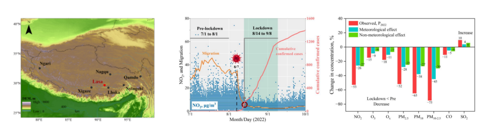
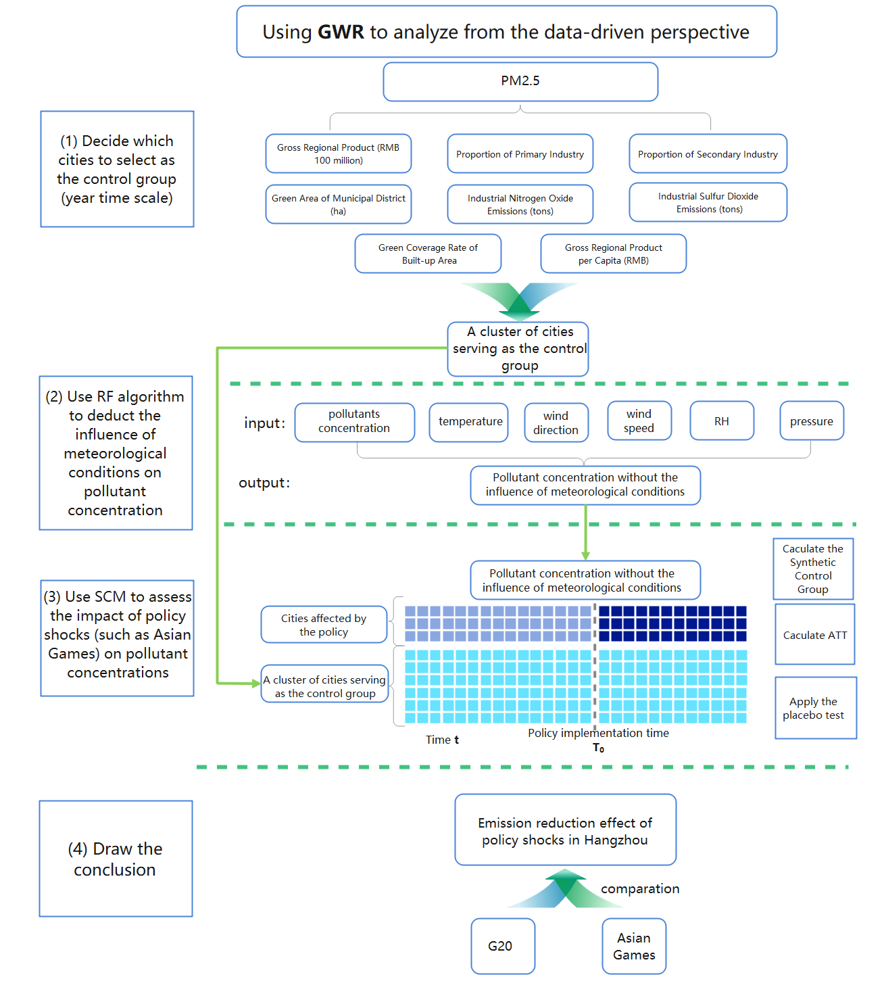

# Publications

Lastest Update: 8th Aug 2023 &nbsp; 																																[中文论文 (Chinese Paper)](https://vanvonzhang.github.io/file/publication/publications-zh/)

## Published Paper

### **2022**

- Variations of air pollutant response to COVID-19 lockdown in cities of the Tibetan Plateau

  Environmental Science: Atmospheres 3 (4), 708-716 	DOI: [10.1039/d2ea00168c](https://doi.org/10.1039/d2ea00168c)

  

  
chart

  
  <style>
      summary {
    padding: 10px;
    background-color: #f2f2f2;
    border: 1px solid #ccc;
    border-radius: 5px;
    cursor: pointer;
  }
      summary:hover {
    background-color: #e6e6e6;
  <style>
  
  

## Working Manuscript

- Effect of policy intervention on emission reduction of fine particulate matter: a case study of the Asian Games in Hangzhou

  （in preparation）

  

  
chart

  
  <style>
      summary {
    padding: 10px;
    background-color: #f2f2f2;
    border: 1px solid #ccc;
    border-radius: 5px;
    cursor: pointer;
  }
      summary:hover {
    background-color: #e6e6e6;
  <style>

  

- Quantifying evolution of soot mixing state from transboundary transport of biomass burning emissions

  journal: [Cell Press One Earth](https://www.cell.com/one-earth/home)

  （under review）

 
